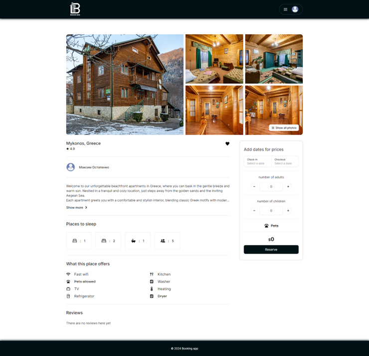

# Booking app



Booking app is a web application inspired by Airbnb that allows users to create rental listings and rent accommodations.

## Frontend tech stack

* React
* Javascript / Typescript
* Zustand
* Axios
* React-Query
* Tinymce

## Backend tech stack

* Dotnet
* EfCore
* MediatR
* AutoMapper

## Quick start

By default, the project comes with a pre-connected test database, so you can use the application immediately after downloading.

### Frontend startup

```
cd Booking-app/client
yarn
yarn dev
```

### Backend startup

```
cd Booking-app/server/Booking.Api
dotnet run
```